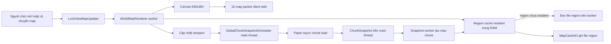
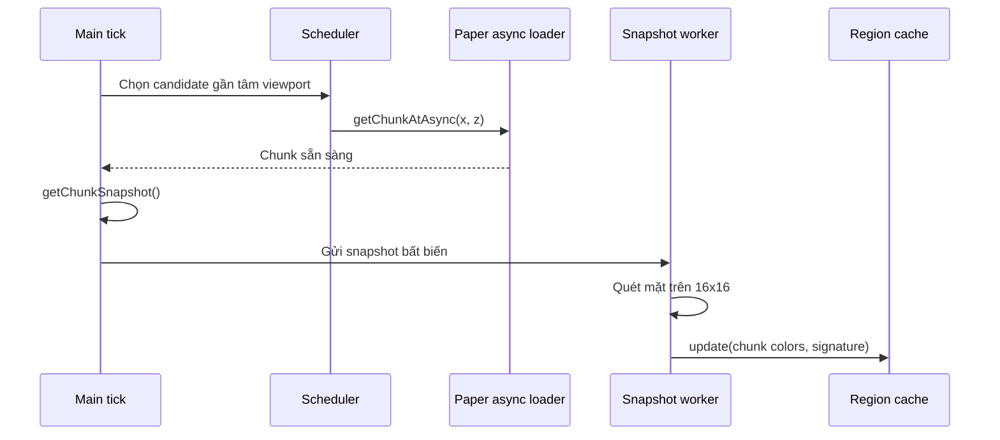
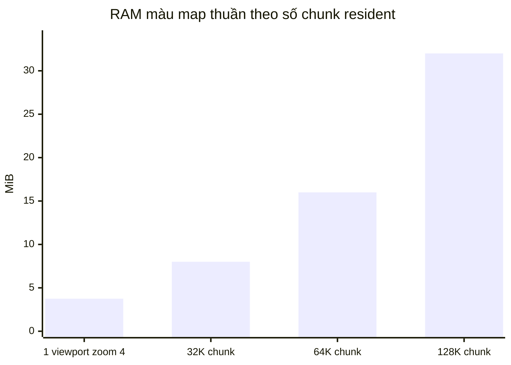
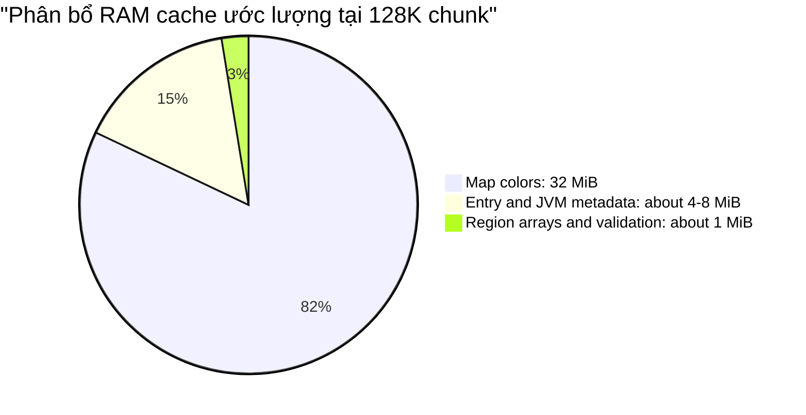
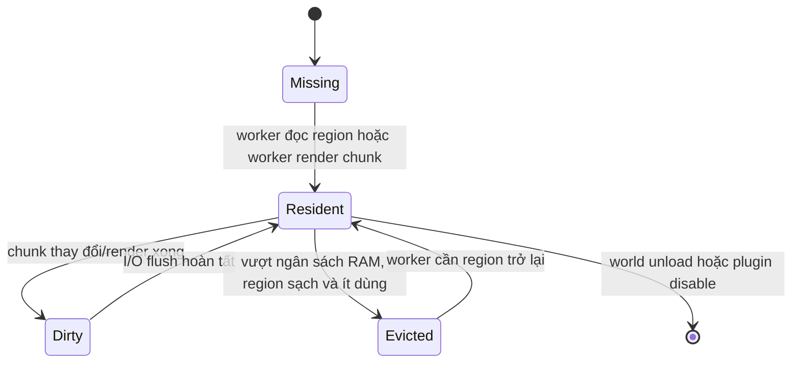

# FancyMap cache architecture

Tài liệu này mô tả luồng tải map, cache, dữ liệu trên đĩa, bộ nhớ và các giới hạn hiện tại của FancyMap.

## Mục tiêu

Cache phải đạt bốn mục tiêu đồng thời:

1. Không thực hiện I/O đĩa hay quét block nặng trên main thread.
2. Mở lại một vùng đã xem nhanh, kể cả sau restart server.
3. Không giữ toàn bộ world trong RAM.
4. Có thể cập nhật lại chunk đã thay đổi.

## Tổng quan



Ba lớp dữ liệu độc lập:

| Lớp | Scope | Dữ liệu chính | Mục đích |
| --- | --- | --- | --- |
| Session | Một người chơi đang mở map | viewport, cursor, `snapshotVersion` | Điều khiển map và yêu cầu render lại |
| Scheduler | Toàn server | job đang tải, retry queue, worker pool | Chia sẻ và giới hạn việc tải chunk |
| Region cache | Một world | màu chunk đã render | Hiển thị nhanh và lưu lâu dài |

`AsyncChunkSnapshotStore` của mỗi session không lưu block, `ChunkSnapshot`, ảnh map, hay hàng nghìn request riêng. Nó chỉ lưu hình chữ nhật viewport và revision.

## LOD khi zoom xa

Mỗi chunk vẫn giữ dữ liệu chi tiết 16×16. Khi một pixel map rộng hơn một chunk,
renderer dùng tầng LOD nhỏ nhất có ô đủ lớn: tầng `n` phủ `2^n × 2^n` chunk.
Các ô được lưu tại `map-cache/<world>/lod/<n>/` nên còn hiệu lực sau restart.

Khi một chunk đổi màu, chỉ một ô cha ở mỗi tầng được tính lại từ tối đa bốn ô
con đang có dữ liệu. Vì vậy chi phí là `O(số tầng)` (tối đa 22), không phụ thuộc
vào diện tích viewport. Scheduler chỉ lấy một chunk đại diện ở tâm mỗi ô LOD;
vùng map được tô dần và màu được cải thiện khi thêm dữ liệu chi tiết.

## Kích thước map và viewport

Canvas hiện cố định 5x3 map vanilla:

```text
5 map x 128 px = 640 px ngang
3 map x 128 px = 384 px dọc
```

Renderer đổi canvas sang block, sau đó sang chunk. Kích thước viewport phụ thuộc `blocks-per-pixel` (zoom):

| Zoom | Block hiển thị | Chunk xấp xỉ |
| --- | ---: | ---: |
| `0.25` | 160x96 | 10x6 |
| `1.0` | 640x384 | 40x24 |
| `4.0` | 2560x1536 | 160x96 |
| `4096.0` | 2.621.440x1.572.864 | 163.840x98.304 |

Ở `4.0`, renderer có thể tham chiếu khoảng 15.360 chunk. Từ zoom lớn hơn
16 block/pixel, nó chuyển sang LOD; scheduler không còn duyệt mọi chunk cơ sở
trong viewport.

## Luồng render

1. `LockViewMapUpdater` phát hiện cursor, zoom, world hoặc `snapshotVersion` thay đổi.
2. Nó tạo `WorldMapRenderer` với tâm map, zoom và `AsyncChunkSnapshotStore` hiện tại.
3. `WorldMapRenderer.render(...)` chạy trên render worker.
4. Renderer tính phạm vi chunk, cập nhật viewport cho scheduler và đọc màu đã cache của từng chunk.
5. Renderer ghép các màu vào `MapCanvas` 640x384, vẽ player/cursor/waypoint rồi gửi các tile map client-side.

Nếu màu một chunk chưa có, pixel của chunk đó giữ màu đen trong render hiện tại. Khi snapshot worker hoàn tất, `snapshotVersion` tăng; updater sẽ render lại sau nhịp refresh tiếp theo.

### Bộ nhớ tạm khi render

Một render tạo các dữ liệu ngắn hạn sau:

| Dữ liệu | Kích thước điển hình |
| --- | ---: |
| `MapCanvas` 640x384 byte | khoảng 240 KiB |
| 15 tile map 128x128 byte | khoảng 240 KiB |
| Mảng reference màu theo chunk | tối đa khoảng 60-120 KiB ở zoom 4 |

Các dữ liệu này chỉ tồn tại trong render worker và được GC sau khi render/send hoàn tất.

## Scheduler và main thread

`GlobalChunkSnapshotScheduler` là scheduler dùng chung cho tất cả map đang mở. Nó chạy mỗi tick trên main thread nhưng chỉ làm điều phối và tạo `ChunkSnapshot`.



Giới hạn mặc định:

```yaml
chunk-scheduler:
  requests-per-tick: 4
  max-in-flight-requests: 16
  snapshot-workers: 2
  max-candidate-scans-per-tick: 512
  max-retries: 3
```

Ý nghĩa:

- Mỗi tick khởi động tối đa 4 lần tải chunk cho toàn server.
- Tối đa 16 job đang bay, gồm chờ tải và xử lý snapshot.
- Chỉ có 2 worker chuyển snapshot thành map colors.
- Candidate được duyệt theo vòng tròn từ tâm viewport, nên phần giữa map có xu hướng đầy trước.

Các giá trị scheduler hiện được đọc khi controller/scheduler khởi tạo; thay đổi chúng cần restart Paper để có hiệu lực hoàn toàn.

## Dữ liệu của một chunk

FancyMap không lưu block state đầy đủ. Một chunk được rút gọn thành:

```text
16 x 16 top-surface map colors = byte[256]
1 signature long                 = 8 byte
```

Mỗi pixel là màu map của block cao nhất tại vị trí tương ứng. Signature được tính từ độ cao và material, dùng để nhận biết dữ liệu render có thay đổi.

Dung lượng màu thuần:

```text
256 byte/chunk
```

Không cache `Block`, NBT, biome object, `ChunkSnapshot`, hay ảnh RGB/RGBA.

## Region cache

World được tách thành region 32x32 chunk:

```text
1 region = 32 x 32 chunk = 1.024 chunk = 512 x 512 block
```

Tọa độ region được tính bằng `floorDiv`, vì vậy tọa độ âm hoạt động bình thường:

```text
chunk (0, 0)    -> region (0, 0), local index (0, 0)
chunk (-1, -1)  -> region (-1, -1), local index (31, 31)
chunk (32, 32)  -> region (1, 1), local index (0, 0)
```

Không có va chạm key giữa các quadrant dương/âm.

### Layout resident trong RAM

Mỗi region resident dùng storage cố định theo index, không dùng `Map<Integer, Entry>`:

```text
AtomicReferenceArray<Entry>[1024]  màu/signature của chunk đã render
AtomicLongArray[16]                1.024 bit validation
AtomicInteger                       số chunk có dữ liệu
dirty + flushScheduled + flushExpedited  trạng thái ghi file
lastAccess                          LRU gần đúng
```

`Entry` và `byte[256]` chỉ được cấp phát khi chunk đã render. Vì vậy region vẫn sparse dù index table có đủ 1.024 slot.

Việc thay mảng cho hash map loại bỏ hash node, boxed `Integer` và validation set cho mỗi chunk.

Mỗi lần render chỉ cập nhật `lastAccess` một lần cho mỗi **region** trong viewport, sau khi đã đọc màu xong. Renderer không còn thực hiện một atomic access update cho từng chunk cache hit.

### Ngân sách RAM

```yaml
map-cache:
  max-entries: 131072
```

Đây là ngân sách **xấp xỉ** theo chunk cho mỗi world resident. Vì cache evict theo region, nó đổi sang:

```text
ceil(131072 / 1024) = 128 region resident/world
```

Biểu đồ dưới đây chỉ tính dữ liệu màu thuần, chưa gồm object và JVM overhead:



Ở cấu hình 128K chunk, màu chiếm tối thiểu 32 MiB. Heap thực tế cao hơn vì còn `Entry`, array header và reference; con số chính xác phụ thuộc JVM và compressed-oops.



Lưu ý quan trọng: giới hạn này là **mỗi world**, không phải toàn server. Nếu nhiều world đều được xem rộng, tổng RAM cache là tổng ngân sách của các world đó.

## File trên đĩa

File cache mới nằm tại:

```text
plugins/FancyMap/map-cache/
  <world-uuid>/
    <region-x>_<region-z>.bin
```

Ví dụ:

```text
map-cache/901ff34c-b586-47b2-932a-865fe0d35abf/-1_0.bin
```

Một file chỉ chứa chunk đã render:

```text
header:
  magic
  format version
  number of stored chunk entries

each stored chunk:
  local region index  (2 byte)
  signature           (8 byte)
  map colors          (256 byte)
```

Một region đầy cần khoảng 266 KiB trên đĩa. Cache không nén để giảm CPU và giữ I/O đơn giản; vùng có nhiều màu lặp sẽ tốn disk hơn cần thiết nhưng không tốn thêm RAM.

## Đọc và ghi file

### Read

- `WorldMapRenderer` gọi cache từ render worker.
- Nếu region chưa resident, worker đọc file region và đưa region vào RAM.
- Scheduler main thread chỉ kiểm tra region đã resident; nó không đọc file đĩa.
- Dữ liệu disk có thể hiển thị ngay trong khi scheduler validate lại chunk nền.

### Write

1. Snapshot worker cập nhật entry và đánh dấu region dirty.
2. I/O executor đơn luồng chờ khoảng 2 giây để gộp update.
3. Nó snapshot 1.024 reference của region.
4. Ghi file `.tmp`.
5. Rename atomically sang file `.bin`.

Nếu có update trong lúc ghi, region được đánh dấu dirty lần nữa và có một flush tiếp theo. File không bị ghi trực tiếp tại chỗ, nên restart giữa lúc ghi không làm hỏng file cũ.

## Eviction và lifecycle



Khi vượt `max-entries`:

1. Cache chọn region sạch có `lastAccess` thấp nhất.
2. Xóa region đó khỏi RAM.
3. Không xóa file disk.
4. Nếu người chơi quay lại, render worker lazy-load file lại.

Region dirty tạm thời không bị evict để tránh mất update chưa ghi. Vì vậy cache có thể vượt ngân sách trong ngắn hạn, đặc biệt khi người chơi di chuyển qua nhiều region mới trong khoảng coalesce 2 giây.

Khi cache vượt quota mà chỉ còn dirty region, FancyMap xếp region dirty cũ nhất vào I/O executor để flush ngay thay vì tiếp tục chờ timer. Sau flush, executor chạy eviction lại. Cơ chế này là backpressure mềm: render/snapshot worker không bị chặn bởi disk I/O, nhưng cache bắt đầu giải phóng RAM sớm hơn.

Khi tắt map, session bị unregister nhưng world cache vẫn ở RAM để mở lại nhanh. Khi world unload, dirty region được flush. Khi plugin disable, tất cả region resident dirty được flush trước khi executor bị dừng.

## Validation và invalidation

Validation bit chỉ tồn tại trong RAM:

- Chunk được snapshot trong phiên hiện tại: validation bit được bật.
- World thay đổi: listener invalidate bit của chunk resident và đánh thức viewport đang xem chunk đó.
- Region vừa đọc từ disk hoặc vừa restart: màu cũ có thể hiện ngay, nhưng validation bit chưa bật. Scheduler sẽ chụp lại dần để cập nhật dữ liệu mới.

Đổi lại, cache không cần tin rằng file disk luôn phản ánh các thay đổi diễn ra khi plugin không chạy hoặc khi region đã bị evict.

## Migration cache cũ

Phiên bản trước dùng một file đơn `<world-uuid>.bin` và giới hạn số entry trong file. Khi map render lần đầu với cache mới:

1. Plugin kiểm tra region directory chưa tồn tại.
2. Worker đọc file cũ.
3. Tách entry sang region tương ứng.
4. Đánh dấu region dirty để I/O executor ghi file region mới.

Sau khi region directory tồn tại, migration không chạy lại. File monolithic cũ không tự xóa để tránh mất dữ liệu nếu migration bị gián đoạn.

## Điểm cần theo dõi để tối ưu tiếp

| Điểm | Vấn đề có thể xảy ra | Hướng tối ưu |
| --- | --- | --- |
| `max-entries` theo world | Nhiều world nhân RAM cache | Global memory budget và LRU xuyên world |
| Dirty region không evict | RAM vượt quota ngắn hạn | Flush sớm khi vượt ngưỡng dirty region |
| Validation không persist | Sau restart vẫn cần revalidate | Revision/invalidation epoch nếu chấp nhận độ phức tạp cao hơn |
| Disk không quota/TTL | Disk tăng theo vùng từng xem | Giới hạn disk hoặc dọn region cũ |
| File không nén | Disk có thể lớn | Chỉ cân nhắc compression khi disk là bottleneck đo được |

### Ưu tiên khuyến nghị

Nếu cần phục vụ nhiều người chơi ở nhiều world, tối ưu quan trọng tiếp theo là **global cache memory budget**. Nó ngăn mỗi world tự dùng toàn bộ `map-cache.max-entries`, trong khi vẫn giữ cache nóng cho world đang có người xem.

## Các hướng tối ưu chưa áp dụng

Một số hướng có lợi trong báo cáo nghiên cứu được giữ lại để chỉ áp dụng khi profiling cho thấy chúng là bottleneck thực tế:

| Hướng | Quyết định hiện tại | Lý do |
| --- | --- | --- |
| Mảng màu phẳng 262.144 byte/region | Chưa áp dụng | Nó tiết kiệm object khi region đầy, nhưng lãng phí gần 256 KiB cho region mới có chỉ vài chunk. Storage sparse hiện tại tốt hơn cho việc khám phá map. |
| S3-FIFO/W-TinyLFU | Chưa áp dụng | Global budget đơn giản cần có trước; thuật toán nhiều queue chưa cần thiết khi chưa có hit-rate/eviction telemetry. |
| Zstd/LZ4 | Chưa áp dụng | Đây là tối ưu disk/CPU, không phải RAM; không thêm dependency khi disk I/O chưa được chứng minh là nút thắt. |
| Memory-mapped/FFM | Chưa áp dụng | Tăng đáng kể độ phức tạp lifecycle, file corruption và Windows file lock. Region I/O async hiện tại an toàn hơn. |
| Persist validation bits | Chưa áp dụng | Có nguy cơ hiển thị map stale sau khi plugin/server không theo dõi thay đổi world. |
| Compact Object Headers | Không dùng | Server mục tiêu chạy Java 21, không dựa vào flag JVM thử nghiệm của phiên bản Java mới hơn. |

## Source code liên quan

- [`PersistentChunkRenderCache`](../src/main/java/dev/funayd/fancyMap/map/PersistentChunkRenderCache.java)
- [`GlobalChunkSnapshotScheduler`](../src/main/java/dev/funayd/fancyMap/map/GlobalChunkSnapshotScheduler.java)
- [`AsyncChunkSnapshotStore`](../src/main/java/dev/funayd/fancyMap/map/AsyncChunkSnapshotStore.java)
- [`WorldMapRenderer`](../src/main/java/dev/funayd/fancyMap/map/WorldMapRenderer.java)
- [`LockViewMapUpdater`](../src/main/java/dev/funayd/fancyMap/lockview/LockViewMapUpdater.java)
